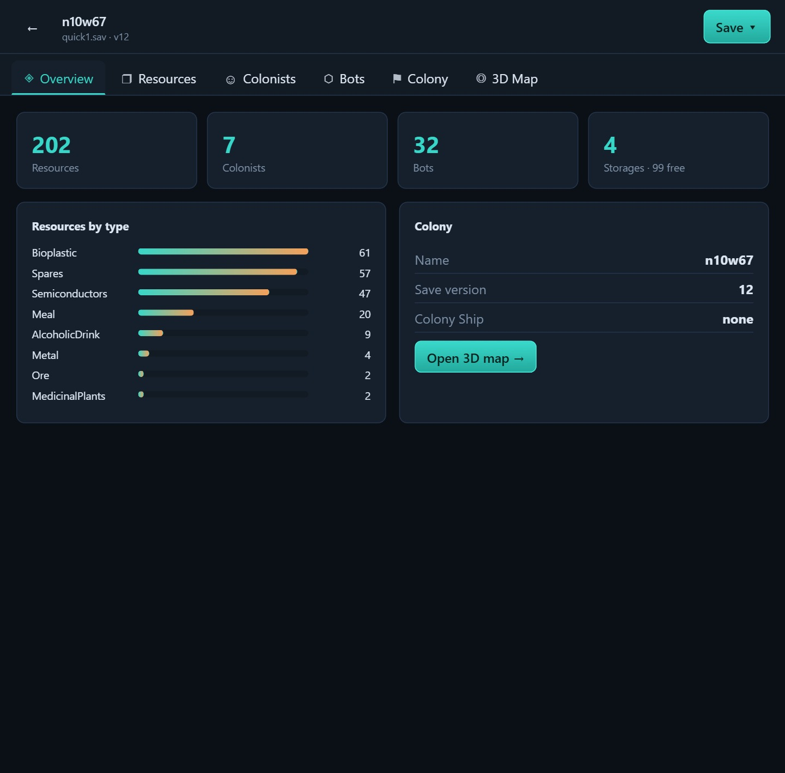
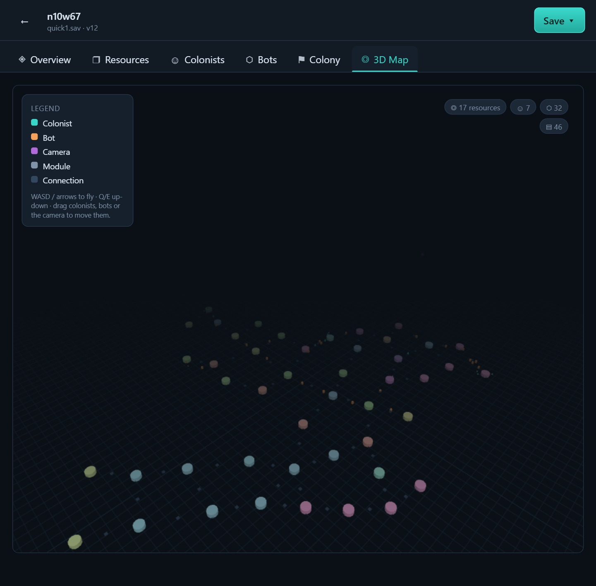
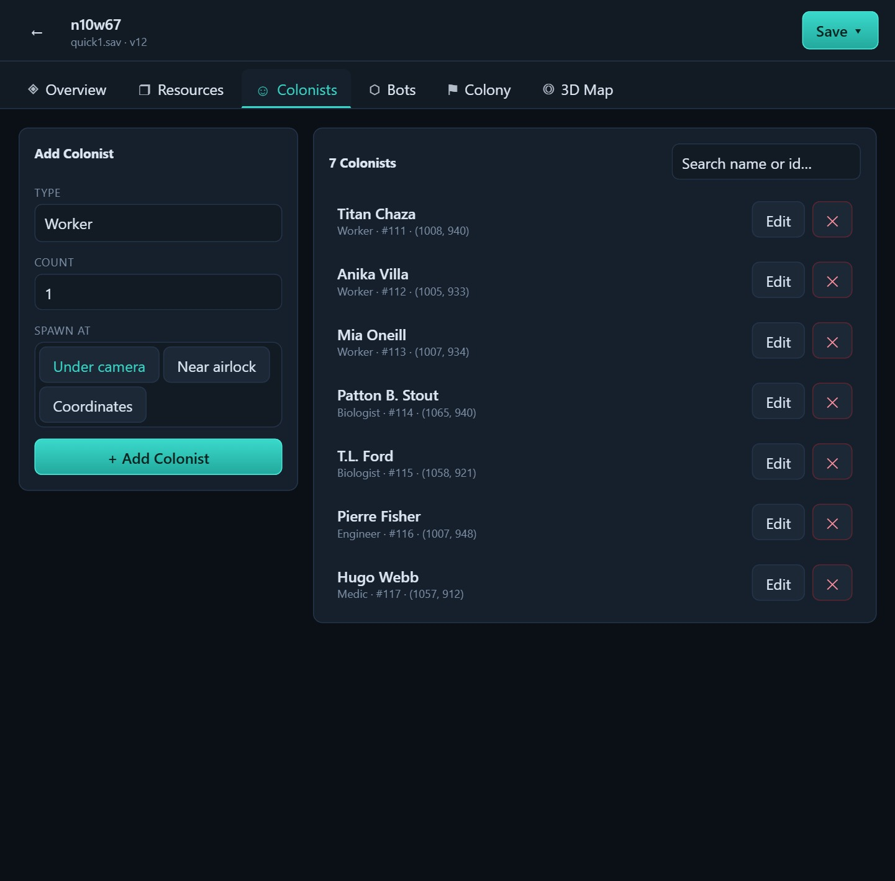

# PlanetBase Save Editor


Редактор файлов сохранения игры PlanetBase с удобным веб-интерфейсом (открывается в браузере) и картой колонии в 3D. Есть и консольная версия для продвинутых.

## Скриншоты

**Обзор колонии** — ресурсы, колонисты, роботы и склады с первого взгляда:



**3D-карта** — все объекты колонии на карте, полёт на WASD, перетаскивание мышью:



**Управление колонистами** — список, поиск, добавление и правка:



## О PlanetBase

PlanetBase — стратегическая игра о строительстве и управлении колонией на чужой планете. Игрок должен развивать поселение, управлять ресурсами и обеспечивать выживание колонистов.

- [Официальный сайт игры](http://www.planetbase.net/)
- [Steam](https://store.steampowered.com/app/403190/Planetbase/)

## Как работает программа
Программа читает ваш файл сохранения Planetbase (`.sav`), вы вносите изменения через удобный интерфейс, и она записывает результат обратно.

Процесс работы:
1. Программа сама находит папку с сохранениями игры (или вы выбираете свою)
2. Вы выбираете нужный файл сохранения и редактируете его в браузере
3. Сохраняете одним из двух способов на выбор:
   - **Новый файл** — рядом создаётся `..._modified.sav`, оригинал не трогается
   - **Перезаписать** — оригинал заменяется, а его копия сохраняется рядом как `.bak`
4. Игра должна быть закрыта во время редактирования — _можно выйти в главное меню_

### 🚨 Важные требования к сохранению
  
*(Пример начального корабля, который НЕ должен быть переработан)*

✅ Рабочие условия - Нужно только для варианта спавна **Colony Ship**:
- Сохранение **должно** содержать начальный корабль в оригинальном состоянии
- Корабль **не должен** быть разобран (переработан в материалы)
- Можно редактировать на любом этапе игры **до переработки корабля**

---

## Установка и запуск (пошагово)

> Не нужно уметь программировать. Просто повторяйте шаги по порядку — займёт 5–10 минут.
> Всё, что в серых рамках — это команды: скопируйте их в терминал и нажмите **Enter**.

### Шаг 1. Установите Node.js через nvm

**nvm** — это программа, которая ставит нужную версию Node.js (движка, на котором работает редактор).

**Windows:**
1. Откройте страницу загрузки: **[nvm для Windows](https://github.com/coreybutler/nvm-windows/releases)**
2. В самом верхнем (последнем) релизе скачайте файл **`nvm-setup.exe`**
3. Запустите его и нажимайте **Далее → Далее → Установить** (ничего менять не нужно)

**Linux / macOS:**
1. Откройте страницу: **[nvm для Linux/macOS](https://github.com/nvm-sh/nvm#installing-and-updating)**
2. Выполните в терминале команду установки:
   ```bash
   curl -o- https://raw.githubusercontent.com/nvm-sh/nvm/v0.40.1/install.sh | bash
   ```
3. Закройте и снова откройте терминал

### Шаг 2. Откройте терминал

Терминал — это окно для ввода команд.

- **Windows:** нажмите **Win + R**, введите `cmd` и нажмите **Enter**.
- **macOS:** откройте программу **Terminal** (Spotlight → «Terminal»).
- **Linux:** откройте **Terminal** (обычно **Ctrl + Alt + T**).

### Шаг 3. Установите Node.js нужной версии

Введите в терминал по очереди (каждую строку — с новой, нажимая Enter):
```bash
nvm install 24.18.0
nvm use 24.18.0
```

### Шаг 4. Скачайте редактор

Проще всего скачать архивом:
1. Откройте [страницу проекта на GitHub](https://github.com/yesfedor/planetbase-save-editor)
2. Нажмите зелёную кнопку **Code → Download ZIP**
3. Распакуйте архив в удобное место (например, на **Рабочий стол**)

_(Если у вас установлен Git — можно вместо этого выполнить `git clone https://github.com/yesfedor/planetbase-save-editor.git`)_

### Шаг 5. Перейдите в папку редактора в терминале

Наберите `cd `, поставьте пробел и **перетащите распакованную папку прямо в окно терминала** — путь подставится сам. Затем нажмите **Enter**:
```bash
cd путь/к/папке/planetbase-save-editor
```

### Шаг 6. Установите зависимости (один раз)

```bash
npm i
```
Пойдёт скачивание — это нормально, подождите 1–3 минуты.

### Шаг 7. Соберите редактор (один раз)

```bash
npm run build
```

### Шаг 8. Запустите редактор

```bash
npm run web
```
В терминале появится ссылка вида **`http://localhost:3000`** — **откройте её в браузере** (скопируйте в адресную строку). Готово, можно редактировать сохранения!

> **Как остановить:** вернитесь в терминал и нажмите **Ctrl + C**.
> **Следующий запуск:** снова откройте терминал, зайдите в папку (Шаг 5) и выполните `npm run web`.
> Шаги 1, 6 и 7 повторять не нужно — только если обновляли редактор (тогда снова `npm run build`).

### Где лежат сохранения игры

Редактор ищет папку игры автоматически. Если нужно указать вручную — вот стандартные пути:
- **Windows**: `%USERPROFILE%\Documents\Planetbase\Saves` (или в `OneDrive\Документы\...`)
- **Linux**: `~/.local/share/Planetbase/Saves`
- **MacOS**: `~/Library/Application Support/Planetbase/Saves`

Файлы сохранений имеют расширение `.sav`.

---

## Возможности редактора

- **Ресурсы** — добавлять и убавлять любой ресурс (в т.ч. сразу по 500), очищать по типу. Место на выбор: под камеру, по координатам, в корабль, **на склад** (до заполнения) или **рядом со шлюзом** (для быстрого заноса)
- **Колонисты и роботы** — создавать, переименовывать, менять специализацию и показатели, лечить, перемещать, удалять
- **3D-карта колонии** — обзор на **WASD / стрелки**, перетаскивание колонистов, роботов и камеры мышью, инспектор объекта по клику
- **Колония** — переименование, настройки посадки (разрешения и проценты специализаций)
- **Сохранение** — новый файл или перезапись оригинала с резервной копией `.bak`

### В планах
- Управление деньгами
- Больше настроек колонии

---

## Для продвинутых: консольная версия

Если не нужен браузер — есть версия в терминале:
```bash
npm run cli
```
